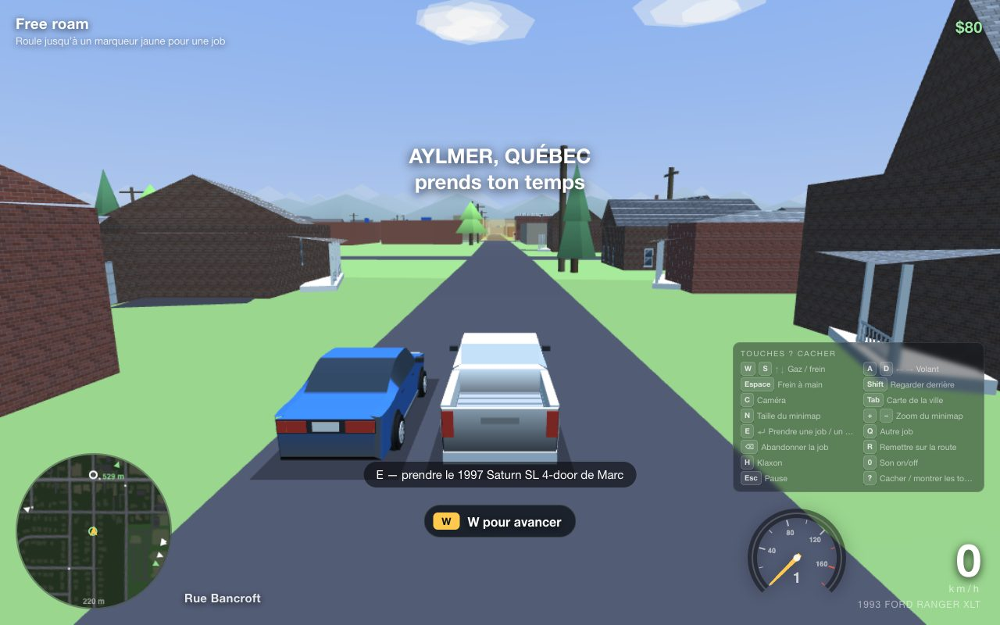
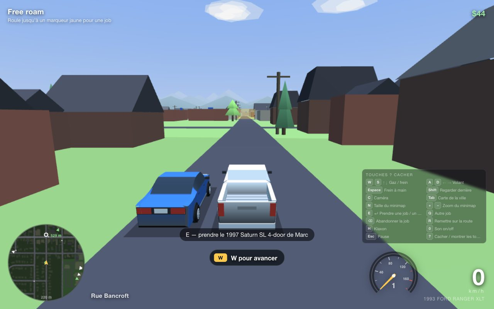
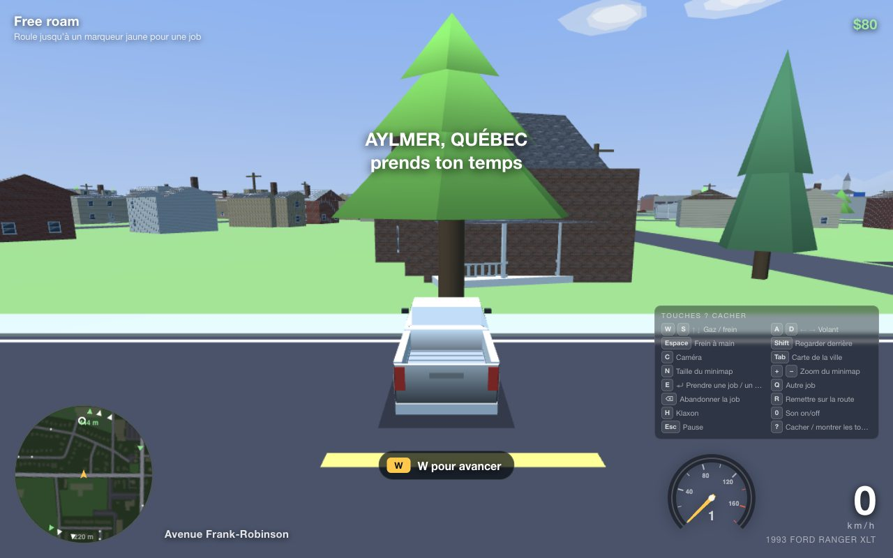
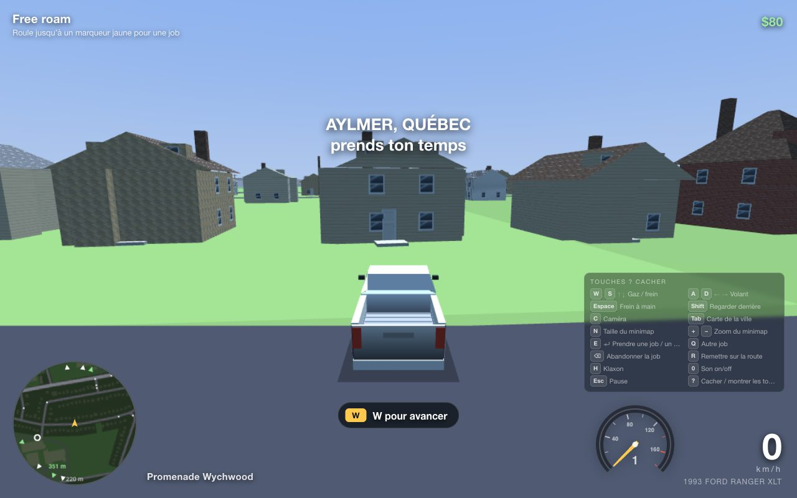
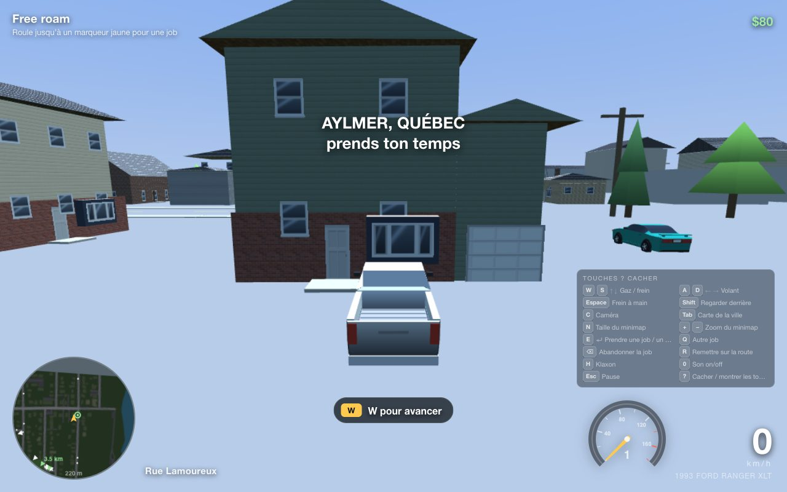
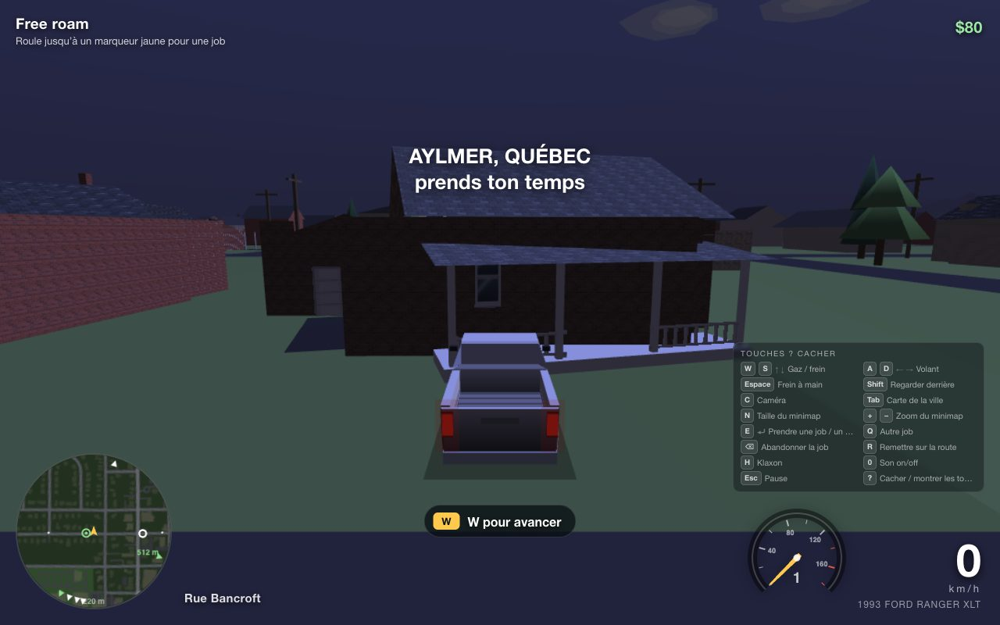
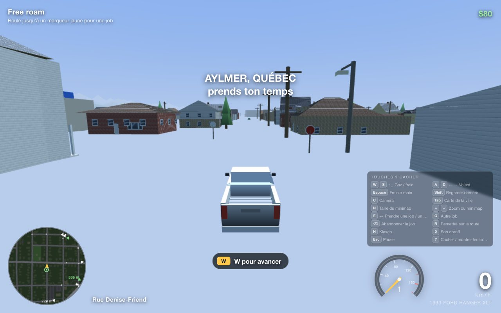
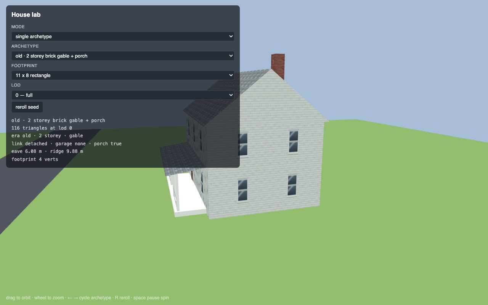

# Making the houses look like Aylmer houses (W1)

Recovered from the original assessment (session of 2026-08-25).
**Phases 1, 2 and 3 are in — see [Status](#status) at the bottom for what the
game actually draws today, with screenshots.**

Short version: don't pull Street View pixels into the game — Google's Maps
Platform terms forbid storing or repurposing Street View imagery (and
Photorealistic 3D Tiles) outside their products, so a scraper-to-textures
pipeline would be both a ToS breach and brittle. What actually makes Aylmer
houses look like Aylmer houses is mostly *data you can get legally*; Street
View's proper role is human reference plus a validation tool.

## What looks wrong today

Every house is the same extruded footprint with a random pastel and a gable
along its longest edge. Real Aylmer reads as **era + neighbourhood**:

- Vieux-Aylmer: 1880–1920 brick and clapboard two-storeys with front porches
- Wychwood / Lakeview: 1950s–60s brick-veneer bungalows, hipped roofs, carports
- Deschênes: cottages
- Lucerne / Champlain: 1970s–90s split-levels and brick-base/vinyl-top
  colonials with attached garages
- North subdivisions: 2000s stone-front, two-car-garage

Nail those five archetypes and it feels right from the driver's seat.

## Phase 1 — Free, legal per-house attributes (the big win, ~1 day)

1. **Gatineau open data: the rôle d'évaluation foncière** (assessment roll).
   Per address: year built, storeys, construction type (plain-pied / à étages /
   split-level), physical link (detached / semi / row), dwelling count. We
   already have an address per footprint from OSM (`addr:*` in
   `data/buildings.json`, sourced from Gatineau's own open data), so it joins
   directly. This decides the archetype for ~90 % of houses.
2. **Québec open LiDAR (MRNF DSM/DTM)** covers the Outaouais. Sampling the
   surface model over each footprint gives real height, roof form (hip vs
   gable), ridge orientation, and garage wings / porches as height steps.
   Replaces "gable along the longest edge" with the actual roof.
3. Footprint shape analysis: L-shapes → attached garage wing on the short leg;
   long thin → row/semi; setback from the road → front-yard depth and driveway
   length.

Output: a `data/houses.json` (per OSM building id: era, storeys, link, roof,
ridgeYaw, height, garage) consumed by `tools/build_map.py`.

## Phase 2 — Archetype system in the engine (2–3 days, the bulk)

Replace extrude-and-cap in `world.js` with ~14 parametric house builders keyed
by (era, storeys, link, roof form): porch with posts, dormers, chimney, bay
window, attached/detached garage with a driveway to the real street, front
steps, hip/gable/mansard roofs, split-level offsets. Each archetype has a
material recipe: base course (brick red/brown/buff, stone) + upper (vinyl
white/beige/grey/blue, clapboard, stucco) + shingle colour. Assignment is
deterministic from Phase 1 data with a seeded jitter so neighbours differ.

## Phase 3 — Real materials, not vertex colours (~1 day)

The engine already has UV/texture support (car skins). Build one 2048²
material atlas: tileable brick, vinyl siding, clapboard, stone veneer, asphalt
shingle, plus window and door decals. Generate tiles with Gemini ("seamless
tileable texture, 512×512, flat lighting…") or procedurally. Walls get tiled
UVs per storey; windows placed by storey count and wall length. Biggest visual
jump per hour.

## Phase 4 — Imagery as ground truth (legally, optional)

- **Mapillary** (CC BY-SA, API permits download) — check Aylmer coverage.
- **Your own drive**: a 30-minute loop with a phone on the dash (Principale,
  Front, Fraser, Lucerne, Wilfrid-Lavigne, Denise-Friend, Deschênes) gives
  ~2,000 geotagged frames you fully own.
- Run each frame through Gemini vision with a fixed schema (siding material,
  colour, storeys, roof form, garage, porch, brick base) → JSON keyed by nearest
  address. Feeds Phase 2 as overrides where the roll is ambiguous.
- Street View: use it the way an artist would — look at each neighbourhood
  while designing the archetypes and palettes. Human reference is fine;
  automated capture isn't.

## Phase 5 — Hero buildings (a weekend with photos)

Ten landmarks hand-modelled with photo-textured facades from your own photos:
Galeries d'Aylmer, Auberge Symmes, the British Hotel and the Principale
storefront row, Église St-Paul, Aréna Frank-Robinson, the Tim on Principale,
Hôtel Deschênes, and the friends' houses (299 Fraser, 75 Denise-Friend,
27 Bancroft, 20 Vanier, 129 Frank-Robinson) — they'll be checked.

## Validation loop

A "photo match" mode in the game: type an address and a heading, the camera
snaps to the curb at Street View height, compare against a Street View
screenshot side by side. Iterate archetypes until the friends' streets pass the
"yeah, that's my street" test.

## Order

Phase 1 → Phase 3 → Phase 2 → Phase 5 → Phase 4. Phases 1 + 3 alone get most
of the way.

## Data (Phase 1 output — this is a contract for Phases 2 and 3)

Phase 1 is done. `data/houses.json` exists, `tools/build_map.py` carries it
into `src/game/mapdata.js`, and `docs/HOUSES-REPORT.md` is the human check.

### Where the numbers come from

| source | what it gives | licence |
|---|---|---|
| **Rôle d'évaluation foncière du Québec** — the *provincial* bulk file, not a Gatineau one. [dataset](https://www.donneesquebec.ca/recherche/dataset/roles-d-evaluation-fonciere-du-quebec) · [Gatineau XML](https://donneesouvertes.affmunqc.net/role/RL81017_2026.xml) (132 MB, 103 287 evaluation units) | année de construction, nombre d'étages, genre de construction, lien physique, nombre de logements, aire d'étages | CC-BY 4.0 (MAMH) |
| **MRNF classified LiDAR**, project `2020_Outaouaisgatineau_Den10`, [1 km LAZ tiles](https://diffusion.mern.gouv.qc.ca/diffusion/RGQ/Lidar/2020_Outaouaisgatineau_Lidar_Den10_DonneesClassifiees/Mtm9/Laz/) in NAD83/MTM 9, class 2 ground + class 6 building | eave and ridge height, roof form, ridge direction, attached garage wing | open, no login |
| **Footprint shape + neighbourhood priors** (`tools/houses_priors.py`) | fills every gap: shared walls → semi/row, minimum-area rectangle → ridge direction, L-shape → garage, setback, era by neighbourhood | — |

Ville de Gatineau's own portal (`gatineau.ca` → Données ouvertes, which redirects
to Données Québec) publishes **no** assessment roll of its own; the provincial
file above is the bulk source and it is per municipality, not per bounding box.
Owner names and cadastre are redacted in it, which is fine — we only want the
building characteristics.

`tools/fetch_roll.py` and `tools/fetch_lidar.py` reproduce both downloads.
Everything they pull lands in `data/raw/`, which is gitignored.

**LiDAR caveat worth knowing.** The MRNF tiles are labelled
*DonneesClassifiees*, but the only classes actually present are 1
(unclassified), 2 (ground), 7 (noise) and 8 (ground model key point) — there is
**no class 6 (building)**. So `tools/lidar_roof.py` recovers the roof surface
the old way instead: a pulse that returned exactly once hit something solid,
and over a footprint that is the roof. Tree canopy mostly gives multiple
returns, and what is left is suppressed by clipping heights at the footprint
median + 6 m. Validated against the roll: median LiDAR eave is 4.3 m for
roll-1-storey, 5.8 m for 1.5, 6.3 m for 2, 9.4 m for 3.

There is **no DSM/MNS or MHC raster published for sheet 31G** (the MRNF derived
products only cover 22E–23D and 32E–33D), and no WCS or ArcGIS ImageServer
serving raw elevation for the Outaouais — `geoegl.msp.gouv.qc.ca` has a WMS
`lidar_mhc` layer but it returns a styled RGB render, useless for measuring.
A 1 m bare-earth MNT GeoTIFF does exist and one tile covers the whole clip
(`.../Imagerie/MNT/2020_Outaouaisgatineau_Mnt_1m/Ccl/Geotiff/MNT2020_7597_4534_CCL_1M.tif`,
296 MB, EPSG:32198) — unused, because class 2 in the point cloud gives the
same ground surface without a second CRS.

### Pipeline

```sh
python3 tools/fetch_roll.py                      # 132 MB XML -> raw/roll_aylmer.json
python3 tools/fetch_lidar.py --venv              # data/raw/venv with laspy+lazrs
python3 tools/fetch_lidar.py                     # 29 LAZ tiles, ~2.2 GB
data/raw/venv/bin/python3 tools/lidar_roof.py    # -> raw/lidar_roofs.json
python3 tools/build_houses.py                    # -> data/houses.json
python3 tools/build_map.py                       # -> src/game/mapdata.js
python3 tools/houses_report.py                   # -> docs/HOUSES-REPORT.md
```

`build_houses.py` prints coverage to stderr. LiDAR is optional: without
`raw/lidar_roofs.json` every roof falls back to shape + era and the `src.lidar`
flag says so.

### `data/houses.json` schema

Keyed by **OSM way id as a string**. Every field is always present.

```json
"61402931": {
  "era":         "old" | "midcentury" | "cottage" | "suburban" | "modern",
  "year":        1924,          // int, or null when the roll had no year
  "storeys":     1 | 1.5 | 2 | 2.5 | 3,
  "link":        "detached" | "semi" | "row" | "apartment",
  "roof":        "gable" | "hip" | "flat" | "mansard" | "shed",
  "ridgeYaw":    -0.096,        // radians, see below
  "height":      6.25,          // eave height, metres
  "ridgeHeight": 8.96,          // metres, or null for a flat roof
  "garage":      "none" | "attached" | "detached" | "carport",
  "porch":       true,
  "src": { "roll": true, "lidar": false, "shape": true }
}
```

**`ridgeYaw` convention — read this.** It uses *exactly* the same convention as
the existing `a` field on a building in `mapdata.js`, i.e. `atan2(dz, dx)` in
the map frame: **0 = +X (east), positive turning toward +Z (south)**. It is
folded into `[-pi/2, pi/2)` because a ridge line has no head or tail. (The
original Phase 1 brief described the opposite convention — `a` in
`build_map.build_buildings()` is `atan2(q[1]-p[1], q[0]-p[0])` over `(x, z)`,
so east-is-zero is what the codebase actually does, and `ridgeYaw` matches it.)

Roof form is the softest field: `tools/lidar_roof.py` calls a roof flat when
its 25th-to-95th-percentile spread is under `FLAT_RANGE` (0.45 m — the
histogram over all 10 304 footprints has a true-flat spike at 0.0-0.1 m and a
trough at 0.25-0.35), and hip when the ridge falls short of the footprint's
ends by more than half the building's width. That last test came out
gable-heavy (73 % gable) against the received wisdom that Wychwood and Lakeview
are bungalow-hip country; it is one constant in `analyse()` if a human with
Street View open decides otherwise.

Era bands: `old` ≤ 1945, `midcentury` 1946–1969, `suburban` 1970–1999,
`modern` ≥ 2000. `cottage` overrides the band for a 1-storey house with a
footprint ≤ 75 m² in Deschênes or within ~300 m of the river bank.

### In `mapdata.js`

Every building now has `id` (the OSM way id). A building with a house record
also has `hs`, the same fields under short keys:

| long | short | note |
|---|---|---|
| — | `id` | on the building, not inside `hs` |
| `era` | `hs.e` | |
| `year` | `hs.y` | omitted when null |
| `storeys` | `hs.s` | |
| `link` | `hs.l` | |
| `roof` | `hs.r` | |
| `ridgeYaw` | `hs.ry` | same convention as the building's `a` |
| `height` | `hs.h` | eave metres — note the building's own `h` is the old extrusion height and is still there |
| `ridgeHeight` | `hs.rh` | omitted when null (flat roof) |
| `garage` | `hs.g` | |
| `porch` | `hs.p` | `1` when true, omitted when false |
| `src` | `hs.sr` | bitmask: 1 roll, 2 LiDAR, 4 shape |

Phase 2 should treat "has `hs`" as "build this as a house", not `k === 'house'`:
`build_map.classify()` calls any untagged 180–600 m² footprint `commercial`,
and 537 of those are dwellings according to the roll.


---

## Status

*(2026-08-25, branch `agent/houses-integrate`.)* Phases 1 → 3 are done and
wired together: real per-house attributes, the parametric archetypes, and the
material atlas on the walls. What follows is what ships and what does not.

### What is done

| | where |
|---|---|
| Per-house attributes from the roll + LiDAR, 10 110 of 10 368 buildings | `data/houses.json` → `mapdata.js` `b.hs` (short keys, decoded by `houses.decodeAttrs`) |
| 14 parametric archetypes, lods 0/1/2 | `src/game/houses.js` |
| 2048² material atlas — 18 tiling materials + 8 alpha-cut decals | `assets/materials/atlas.png` + `.json`, `src/game/materials.js` |
| Houses textured at real-world scale (7.5 cm brick courses, 20 cm vinyl laps, 16 cm shingle courses) | `MeshBuilder.autoUV` + `Materials.tile()` |
| Distance LOD, lod 0 near / lod 2 far, one draw per chunk per set | `world.js` `HOUSE_NEAR`, `draw()` |
| Atlas failure falls back to the old vertex-colour look | `main.js` `worldStages()` → `materials_stub.js` |

**How the texturing works.** `Materials.tile(mb, name, {ox, oz})` arms a
material on a MeshBuilder; every vertex emitted afterwards that does not carry
its own UV gets one *projected from its world position* at the tile's real size
(`mesh.js` `autoUV`) — horizontal faces onto XZ, everything else onto
(tangent, up-slope), so shingle courses keep their size on a pitch and siding
laps stay level and continuous around a corner. That means the dumb primitives
— `prism`, `roof`, `hip`, `tower`, `mansard` — come out in brick without
knowing what a UV is, and `houses.js` only has to say which material is on
which surface. The projection origin is the building centre, so the repeat
counts stay small and `fract()` in the shader stays exact. Decals (windows,
doors, garage doors, the porch rail) are the other path: absolute atlas UVs,
`rect` left at zero, alpha-cut by the shader, 4.5 cm proud of the wall.

Vertex colours are still there and still matter: the texture *multiplies* them,
so `mats.tint()` hands out a near-white per-house jitter under the atlas and
the material's own colour without one. Same call site, both paths.

### Numbers

Whole map, 10 110 houses, measured with `node tools/smoke_world.mjs`:

| | triangles |
|---|---|
| the town (roads, ground, trees, non-house buildings) | 197 k |
| houses, near bake (lod 0) | 893 k |
| houses, far bake (lod 2) | 230 k |
| **resident total** | **1.32 M** |

Drawn per frame, medium quality, world geometry only (`A.stats()`):

| | this branch | before (lod 1, one mesh) |
|---|---|---|
| Chemin Foley (299 Fraser) | 22.8 k (4.9 k of it lod 0 houses) | 20.8 k |
| Rue Bancroft (Principale) | 28.3 k (6.1 k) | 28.1 k |
| Rue Denise-Friend | 36.5 k (13.9 k) | 29.7 k |

Denise-Friend is the worst case in town — a dense block where a third of what
you see is lod 0 houses, and the only spot that is meaningfully over the old
build (+23 %). Two of the three match it. The draw count goes from 16-18 chunk
draws to 30-34 (a town mesh and a house mesh per chunk, the houses batched into
one textured pass at the end of the frame), which is the part worth watching if
the chunk size ever changes.

Bake is 480 ms in node and ~680 ms in the browser including the GL uploads (it
was 180 ms). Vertex + index data is 153 MB, up from ~42 MB: 2.77 M vertices, of
which 1.86 M carry UV + atlas rect and therefore cost 60 B each instead of 36 B
(the near bake is the only textured geometry — 117 MB of the total).

That is the deliberate trade, and the two ways out were both worse:
`rect` could be squeezed from a vec4 to a tile id in one float — 22 MB back, at
the price of the shader recomputing the cell and a contract change across
materials.js, houses_demo and two smoke tests; and lod **1** for the near bake
would save ~75 MB but costs the windows, doors, porches and garage doors, which
are the entire visible payoff. 153 MB of static buffers is not what limits a
MacBook Air with unified memory — the bake time is the number to watch if this
grows again.

### Screenshots

All 1280×800, headless Chrome, medium quality.

| | |
|---|---|
|  |  |
| **Rue Bancroft, Vieux-Aylmer** — brick, porches with rails, driveways | **the same camera before this branch** — extrude-and-cap |
|  |  |
| **Avenue Frank-Robinson at 129** | **Promenade Wychwood** |
|  |  |
| **Chemin Vanier** — brick base course, vinyl above, garage door | **Rue Bancroft, night** |
|  |  |
| **Rue Denise-Friend** | **`src/game/houses_lab.html`** — 15 cm clapboard laps, 2-pane window decals, brick chimney, siding (not shingle) on the gable end |

Two things those shots also show, neither of them new here: the ground and road
surfaces are missing in some blocks (Denise-Friend, the marina, the Vanier
subdivision) — identical on `main`, so it is a gap in the landuse polygons, not
in the houses; and the sepia cast on a couple of frames is the job-offer
overlay, not the renderer.

### What is left

* **Roof form is 73 % gable** out of the LiDAR (`tools/lidar_roof.py`), which
  reads too gable-heavy on the Wychwood and Lakeview bungalow streets. One
  constant in `analyse()` if someone with Street View open wants to argue.
* **Bay windows are a coloured box**, not a decal — the only front element that
  still looks like 2003.
* **Porches and back sheds are not collidable.** `buildHouse` registers exactly
  the footprint ring, same as the old code; the porch deck projects 2.1 m past
  the front wall and you can drive through it.
* **The far bake is untextured** (vertex colours at the tile's average colour).
  It matches well enough that the 200 m swap is hard to catch, but it is a swap.
* **`maxLevel` is capped at 4** on the atlas (`materials.js`): the cells only
  carry 8 px of bleed, so from mip 5 a cell starts averaging in its neighbour.
  A regenerated atlas with 16 px of bleed would let the chain run one level
  further and would be a little calmer at 150 m.
* `src/game/houses_lab.html` now loads the real atlas too, so the archetype /
  footprint / lod dropdowns are the fastest way to check a material change.
* Phase 5 (hero buildings) and Phase 4 (Mapillary / own-drive imagery) are
  untouched.
